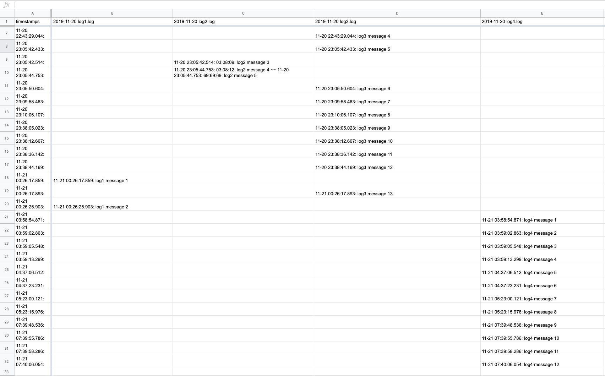

# logParser
a python log parser. creates a csv file of all logs in a directory. useful for examining log data of machines running in a network. tested with the app "serial" generating logs. https://www.decisivetactics.com/products/serial/

# ***********************************************************************************************
# Log Parser
# Author: Mike Cole
# Description : 
This script looks at all .log files in a specified directory and outputs a single .csv file that maps them to a single timeline. 
# 

# Dependencies: 
python 2.7

# Usage : 

python logparser.py path/to/logfile/directory
CSV file will appear in the directory the logs are in.

the script accepts log files of the following form:

 ---------- 2019-11-20 20:02:00 -0600: Logging Started ----------

 11-20 20:56:16.443: 00:58:44: log text ...
 11-20 22:43:21.167: 02:45:48: more log text...

 ***********************************************************************************************
